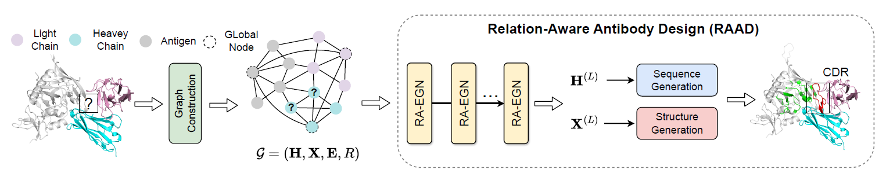

# RAAD
**Relation-Aware Equivariant Graph Networks for Epitope-Unknown Antibody Design and Specificity Optimization**

Lirong Wu, Haitao Lin, Yufei Huang, Zhangyang Gao, Cheng Tan, Yunfan Liu, Tailin Wu, Stan Z. Li. In [AAAI](https://openreview.net/forum?id=g22j55xLz2), 2025.

<p align="center">
  
</p>


## Dependencies

The script for environment setup is available in `scripts/setup.sh`, please install the dependencies before running code.

```
bash scripts/setup.sh
```


## Dataset

| Dataset                                                      | Download Script                                              |
| ------------------------------------------------------------ | ------------------------------------------------------------ |
| [SAbDab](https://opig.stats.ox.ac.uk/webapps/sabdab-sabpred/sabdab/) | [`scripts/prepare_data_kfold.sh`](./scripts/prepare_data_kfold.sh) |
| [RAbD](https://pmc.ncbi.nlm.nih.gov/articles/PMC5942852/)    | [`scripts/prepare_data_rabd.sh`](./scripts/prepare_data_rabd.sh) |
| [SKEMPI v2](https://life.bsc.es/pid/skempi2)                 | [`scripts/prepare_data_skempi.sh`](./scripts/prepare_data_skempi.sh) |

We have provided the summary data used in our paper from SAbDab, RAbD, SKEMPI_V2 in the summaries folder, and you can use the above scripts to download the required data. The processed data can be downloaded from [Google Drive](https://drive.google.com/file/d/1jYNOv_5N0-4RLRBbGTDzyrKsOo7vBNhH/view?usp=drive_link). After downloading `data for RAAD.zip`, unzip it and replace the summaries folder with the processed datasets.


## Usage

### K-fold training & evaluation on SAbDab

```
python -B train.py --cdr_type 1 --optimization 0
```

where `cdr_type` denotes the type of CDR on the heavy chain. 

The customized hyperparameters can be searched in the space provided by `. /configs/search_space.json`.


### Antigen-binding CDR-H3 Design

```
python -B train.py --optimization 1
```

The customized hyperparameters can be searched in the space provided by `. /configs/search_space.json`.


### Affinity Optimization

```
python -B train.py --optimization 2
```

The customized hyperparameters can be searched in the space provided by `. /configs/search_space.json`.


## Citation

If you are interested in our repository and our paper, please cite the following paper:

```
@inproceedings{wu2025relation,
  title={Relation-aware equivariant graph networks for epitope-unknown antibody design and specificity optimization},
  author={Wu, Lirong and Lin, Haitao and Huang, Yufei and Gao, Zhangyang and Tan, Cheng and Liu, Yunfan and Wu, Tailin and Li, Stan Z},
  booktitle={Proceedings of the AAAI Conference on Artificial Intelligence},
  volume={39},
  number={1},
  pages={895--904},
  year={2025}
}
```


## Feedback

If you have any issue about this work, please feel free to contact me by email: 
* Lirong Wu: wulirong@westlake.edu.cn


## Others

Many thanks for the code provided below

* MEAN: https://github.com/THUNLP-MT/MEAN/
* GeoAB: https://github.com/EDAPINENUT/GeoAB
